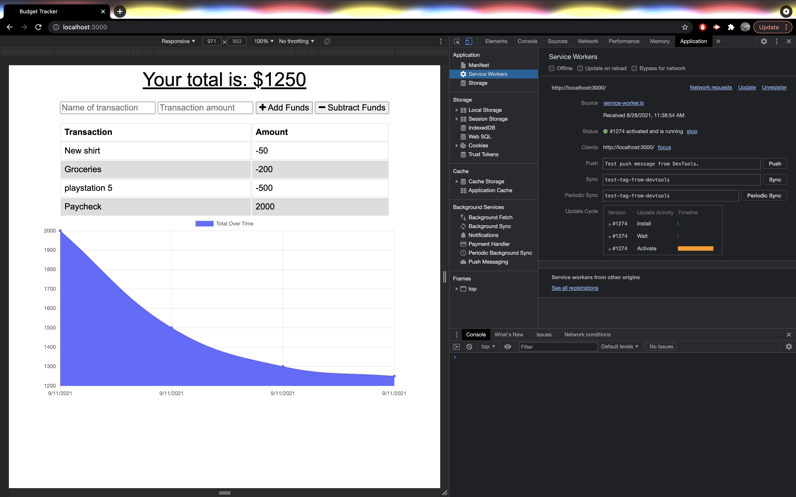

# Budget-Tracker
## Description
Budget Tracker is a progressive web application that allows the user to add or subtract expenses within their budget at any given scenerio. Users are able to access such database online/offline or with poor internet connection at their disposal.
## Installation 
To install the required dependencies, run the command npm install
## To use
To use the application, run npm start
Go to http://localhost:3000 in your preferred browser

## Application preview

## User Story
AS AN avid traveller
I WANT to be able to track my withdrawals and deposits with or without a data/internet connection
SO THAT my account balance is accurate when I am traveling

## Business Context 
Giving users a fast and easy way to track their money is important, but allowing them to access that information anytime is even more important. Having offline functionality is paramount to our applications success.

## Acceptance Criteria
GIVEN a user is on Budget App without an internet connection
WHEN the user inputs a withdrawal or deposit
THEN that will be shown on the page, and added to their transaction history when their connection is back online.